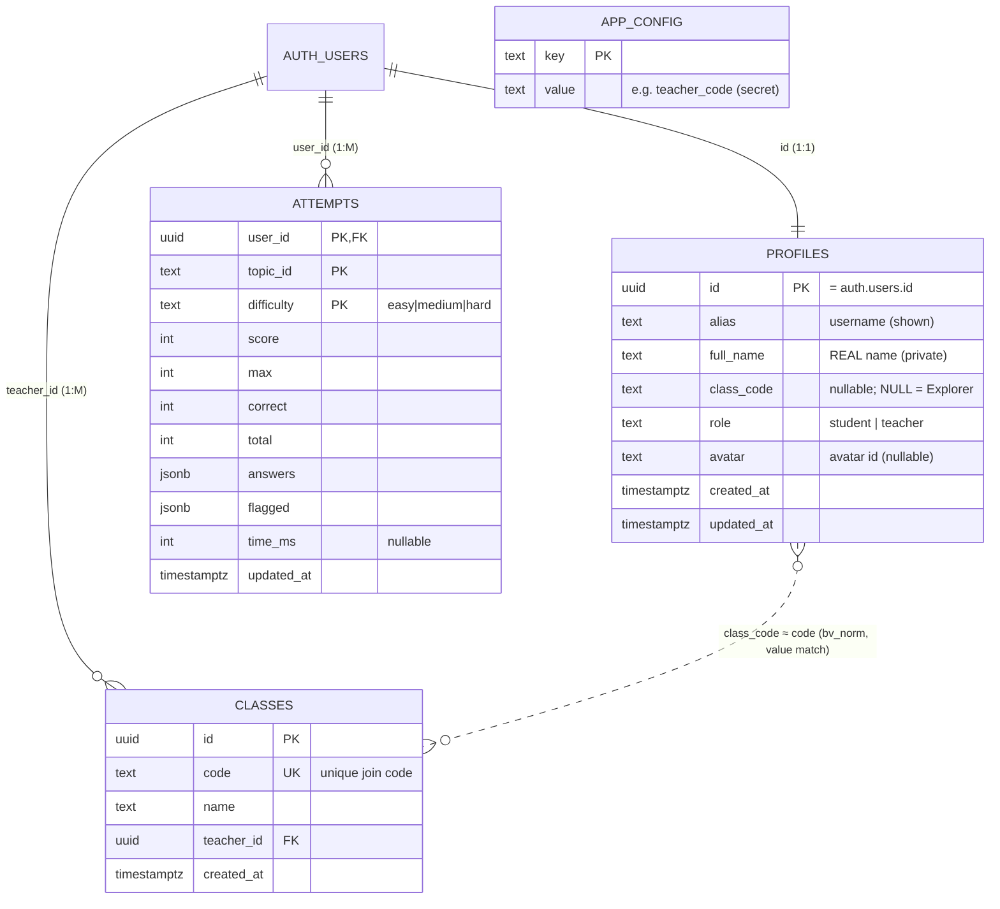

# 10 — Database Documentation

**Database:** PostgreSQL, hosted by **Supabase** (project ref `znzboqqvtykwvsykkrxs`). Schema is
defined by the SQL files in `supabase/`, run in order in the Supabase SQL Editor.

> ⚠️ **Doc drift to know about:** the header comment in `supabase/schema.sql` describes the *original*
> Phase‑0 design (“anonymous auth… no real names, no passwords”). That is **superseded**: later
> migrations (`accounts.sql`) added `full_name` + `role`, and the app uses **real username+password
> accounts**. This document describes the **current** state after all migrations.

## Migration order (authoritative)

1. `schema.sql` — `profiles`, `attempts`, keep‑best trigger, leaderboard functions (v1)
2. `accounts.sql` — adds `profiles.full_name`, `profiles.role`
3. `teacher.sql` — `classes`, `app_config`, teacher RPCs, `bv_norm()`, password reset; drops
   `class_code NOT NULL`; re‑defines the board functions to `role='student'`
4. `avatars.sql` — adds `profiles.avatar`; re‑defines board + roster functions to include avatar
5. `competition.sql` — adds `attempts.time_ms`; upgrades keep‑best to a speed tie‑break; re‑defines
   board functions to **competitors only** + `time_ms`
6. `teacher-insights.sql` — `get_class_scores()`, `rename_class()`
7. `class-lookup.sql` — `class_by_code()`
8. `teacher-activity.sql` — `get_teacher_activity()`, `get_teacher_topscore()` (read-only;
   exposes `attempts.updated_at` and `score`/`max` to the teacher console)

   Patch (run only if needed): `fix-signup.sql` — makes `profiles.class_code` nullable and
   re-asserts the owner RLS policies.

## 1. Schema overview

```
auth.users (managed by Supabase Auth) ──1:1──▶ profiles
                                                  │
                                     1:M (user_id)│
                                                  ▼
                                              attempts

classes.teacher_id ──▶ auth.users        app_config (key/value; secret teacher_code)

Link between a student and a class is by VALUE, not a foreign key:
  profiles.class_code  ≈  classes.code   (compared via bv_norm(): trim/collapse-space/UPPERCASE)
```

## 2. ERD



`}o..o{` denotes a **value‑based** relationship (not a DB foreign key): a student's `class_code` is
matched to a class's `code` through the `bv_norm()` helper.

## 3. Table dictionary

### `profiles`
Purpose: one row per user; identity + role + settings. RLS: a user reads/writes **only their own
row**.

| Column | Type | Key | Nullable | Description |
|---|---|---|---|---|
| `id` | uuid | **PK**, FK → `auth.users(id)` on delete cascade | no | Same id as the auth user |
| `alias` | text | | no | Username (public; shown on leaderboard). Check: 1–40 chars |
| `full_name` | text | | yes | **Real name — private**, teacher‑only (added in `accounts.sql`) |
| `class_code` | text | | **yes** | Join code; **NULL = Explorer** (made nullable in `teacher.sql`) |
| `role` | text | | no (default `student`) | `student` or `teacher` (check constraint) |
| `avatar` | text | | yes | Avatar id (e.g. `kid-goggles`) — added in `avatars.sql` |
| `created_at` | timestamptz | | no (default now) | |
| `updated_at` | timestamptz | | no (default now) | |

### `attempts`
Purpose: the **best** quiz attempt per (student, topic, difficulty). RLS: a user reads/writes only
their own rows. A trigger keeps the best attempt.

| Column | Type | Key | Nullable | Description |
|---|---|---|---|---|
| `user_id` | uuid | **PK**, FK → `auth.users(id)` cascade | no | Owner |
| `topic_id` | text | **PK** | no | Topic id (e.g. `animal-cells`) |
| `difficulty` | text | **PK** | no | `easy`/`medium`/`hard` (check) |
| `score` | int | | no | Points earned |
| `max` | int | | no | Max possible points for the attempt |
| `correct` | int | | no | Correct answers |
| `total` | int | | no | Questions in the attempt (10) |
| `answers` | jsonb | | yes | Per‑question `{qId, chosen, correct, ms}` |
| `flagged` | jsonb | | yes | Flagged question ids |
| `time_ms` | int | | **yes** | Total answering time (speed tie‑break) — added in `competition.sql` |
| `updated_at` | timestamptz | | no (default now) | |

Composite **primary key**: `(user_id, topic_id, difficulty)` — one best row per level.

### `classes`
Purpose: teacher‑owned classes. RLS: a teacher may `select` only rows where `teacher_id =
auth.uid()`; inserts happen via the `create_class` function.

| Column | Type | Key | Nullable | Description |
|---|---|---|---|---|
| `id` | uuid | **PK** (default `gen_random_uuid()`) | no | |
| `code` | text | **UNIQUE** | no | Join code (5 chars from a no‑ambiguous alphabet) |
| `name` | text | | no | Class name (e.g. “Grade 7 - Rizal”) |
| `teacher_id` | uuid | FK → `auth.users(id)` cascade | no | Owner |
| `created_at` | timestamptz | | no (default now) | |

### `app_config`
Purpose: server‑side secret store — currently the **teacher sign‑up code**. RLS **on**, **no
policies**, grants **revoked** from `anon`/`authenticated` → **no client can read it**; only
SECURITY DEFINER functions (owned by `postgres`) can.

| Column | Type | Key | Description |
|---|---|---|---|
| `key` | text | **PK** | e.g. `teacher_code` |
| `value` | text | | the secret (set by the admin; **not** stored in this repo) |

## 4. Constraints, triggers, indexes

- **Checks:** `profiles.alias` 1–40 chars; `profiles.role in ('student','teacher')`;
  `attempts.difficulty in ('easy','medium','hard')`; `classes.code` unique.
- **Cascade deletes:** deleting an `auth.users` row cascades to `profiles`, `attempts`, and owned
  `classes`.
- **Trigger `attempts_keep_best_trg`** (BEFORE UPDATE on `attempts`) runs
  `attempts_keep_best()`: rejects an update with a **lower score**, and (after `competition.sql`)
  rejects an equal score that is **not faster** — so the stored row is always the best/fastest.
- **Indexes:** the primary keys provide the main indexes (`profiles.id`, the composite
  `attempts` PK, `classes.id`, `classes.code` unique). No additional custom indexes are defined.
  For the current dataset size this is fine; see [`18-performance.md`](18-performance.md).

## 5. Row‑Level Security (RLS) summary

| Table | RLS | Policies |
|---|---|---|
| `profiles` | ON | select/insert/update **own** (`auth.uid() = id`) |
| `attempts` | ON | select/insert/update **own** (`auth.uid() = user_id`) |
| `classes` | ON | select **own** (`auth.uid() = teacher_id`); writes via `create_class`/`rename_class` |
| `app_config` | ON | **no policies + grants revoked** → unreadable by clients |

Cross‑user reads (leaderboards, rosters) are **not** done by opening RLS — they go through
**SECURITY DEFINER functions** that return only safe, aggregated data or enforce “owning teacher
only.” See [`11-api-reference.md`](11-api-reference.md).

## 6. Privacy design (defensible in a panel)

- A student's **real name never leaves their own row** except to their **own teacher** via
  `get_class_roster` / `get_class_scores` (both check `classes.teacher_id = auth.uid()`).
- The leaderboard functions **exclude teachers** (`role='student'`), **include only competitors**
  (non‑null class code), and select **no real names and no per‑question data** — just
  alias/class_code/avatar/score/badges/time.
- The secret teacher code lives in `app_config`, which is unreadable by any client.
